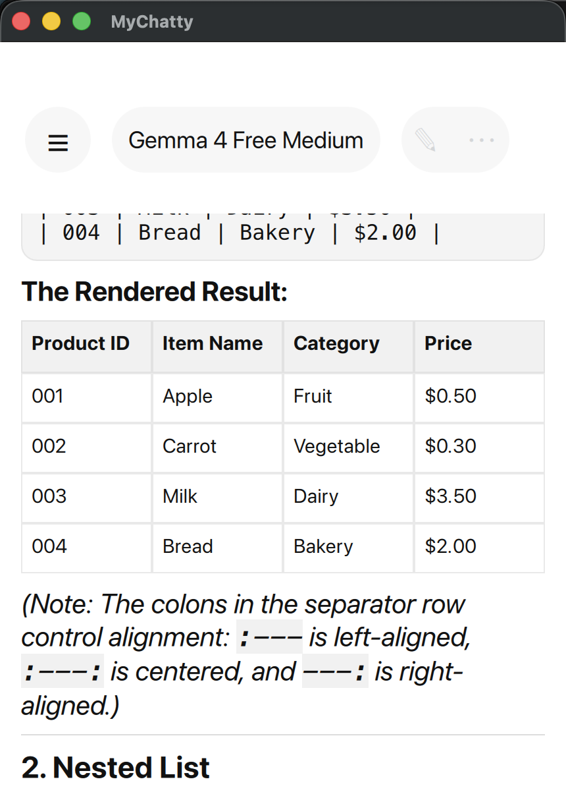

# MyChatty

<p align="center">
  
</p>

MyChatty is a Qt Quick AI chat client backed by a shared C++ core library. It
was started as a cross-platform Qt implementation of a ChatGPT-like app with a
native desktop/mobile UI, streaming model responses, a CLI for live API probes,
and JSON export compatibility with the older
[ndurner/oai_chat](https://github.com/ndurner/oai_chat) project.

The project deliberately keeps provider logic out of the QML layer. The app and
CLI both use `mychatty_core`, so provider bugs can be reproduced from a terminal
without duplicating request serialization or streaming parsing code.

## Features

- Qt Quick chat UI with a start screen, sidebar recents, settings sheet,
  model/effort selector, attachment menu, and assistant action buttons.
- Markdown rendering for assistant messages, including bold text, code fences,
  tables, links, and bare URLs.
- Streaming OpenAI Responses API client in `OpenaiResponsesAPI`.
- Streaming OpenRouter chat-completions client in `OpenaiChatAPI`.
- Model catalog entries for GPT-5.5, GPT-5.4 mini, GPT-5.5 Pro, GLM-5.2, and a
  free Gemma test model.
- GLM-5.2 routing through OpenRouter with Parasail pinned as the provider.
- Settings for OpenAI and OpenRouter API keys plus Custom instructions.
- Web search settings for provider-backed search and optional
  [Exa](https://exa.ai/) search.
- Local conversation persistence with a Recents sidebar.
- Share/export to an `oai_chat`-style JSON shape: a top-level `messages` array
  containing system, user, and assistant messages.
- OpenAI text-to-speech read-aloud support for assistant messages.
- CLI dry-runs, cached live calls, raw JSON output, and optional OpenAI web
  search probing.

## Project Layout

```text
src/app/          Qt app entry point
src/app/qml/      QML views and controls
src/core/         Shared provider, storage, Markdown, settings, and TTS code
src/cli/          Terminal client using the shared core
tests/            Qt Test coverage for core behavior
```

The main build targets are:

- `MyChatty`: the Qt Quick application.
- `mychatty-cli`: the provider test CLI.
- `mychatty_core_tests`: focused core unit tests.

## Requirements

- CMake 3.25 or newer.
- Qt 6.8 or newer with Core, Gui, Network, Qml, Quick, Quick Controls 2,
  Quick Dialogs 2, and Test.
- A C++20 compiler.
- API keys for live provider calls:
  - `OPENAI_API_KEY` for OpenAI Responses and text-to-speech.
  - `OPENROUTER_API_KEY` for OpenRouter.
  - `EXA_API_KEY` for OpenAI Exa MCP calls when using a private Exa key.

The app stores keys in `QSettings` through the Settings sheet. The CLI reads
API keys from the same environment variables.

## Build

From the repository root:

```sh
qt-cmake -S . -B build
cmake --build build
ctest --test-dir build --output-on-failure
```

For the active Qt Creator debug build tree used during development:

```sh
cmake --build build/Qt_6_12_0_for_macOS-Debug --target MyChatty
"./build/Qt_6_12_0_for_macOS-Debug/bin/MyChatty.app/Contents/MacOS/MyChatty"
```

Do not treat a successful build as proof that QML loads. After QML changes,
launch the exact app binary from the active build tree and check for
`QQmlApplicationEngine failed to load component`.

## Run

For the default local build:

```sh
./build/bin/MyChatty
```

On macOS bundle-style build trees, run the app binary inside the bundle, for
example:

```sh
"./build/Qt_6_12_0_for_macOS-Debug/bin/MyChatty.app/Contents/MacOS/MyChatty"
```

The app has developer UI launch states that are useful for visual checks:

```sh
./build/bin/MyChatty --ui-state=selector
./build/bin/MyChatty --ui-state=model-list
./build/bin/MyChatty --ui-state=sidebar
./build/bin/MyChatty --ui-state=settings
./build/bin/MyChatty --ui-state=personalization
./build/bin/MyChatty --ui-state=attachments
```

## CLI

The CLI sends requests through the same provider classes as the app.

```sh
./build/bin/mychatty-cli \
  --provider openai \
  --model gpt-5.4-mini \
  --prompt "Reply with one sentence."

./build/bin/mychatty-cli \
  --provider openrouter \
  --model google/gemma-4-26b-a4b-it:free \
  --prompt "Reply with one sentence."
```

Use `--dry-run` to inspect the JSON payload without making a network request:

```sh
./build/bin/mychatty-cli \
  --provider openrouter \
  --model z-ai/glm-5.2 \
  --dry-run \
  --prompt "Say hello."
```

Useful options:

- `--effort "Medium"`: selects the reasoning/effort mapping.
- `--max-tokens 256`: caps output tokens.
- `--instructions "..."`: adds custom instructions.
- `--web-search`: enables web search for OpenAI and OpenRouter calls.
- `--exa-search`: uses [Exa](https://exa.ai/) for web search instead of the
  provider/default search path.
- `--json`: prints text, reasoning, raw output items, raw response, raw events,
  and usage as JSON.
- `--no-cache`: bypasses the CLI response cache.

By default, live CLI responses are cached under the platform cache directory so
repeat probes do not spend API credits unnecessarily.

## Provider Notes

OpenAI calls use the Responses API endpoint:

```text
https://api.openai.com/v1/responses
```

OpenRouter calls use the chat completions endpoint:

```text
https://openrouter.ai/api/v1/chat/completions
```

This split is reflected in the code names: `OpenaiResponsesAPI` for OpenAI's
Responses API and `OpenaiChatAPI` for the OpenAI-compatible chat-completions
schema used by OpenRouter.

Web search is controlled by two settings. `Web Search` is enabled by default.
When `Use Exa` is disabled, OpenAI uses the Responses API `web_search` tool and
OpenRouter uses its `web` plugin without forcing an engine; forcing
`engine: "native"` can fail on models that do not support native provider
search. When `Use Exa` is enabled, OpenAI uses [Exa](https://exa.ai/) through
the remote MCP server at `https://mcp.exa.ai/mcp`, while OpenRouter uses its own
web plugin with `engine: "exa"`; this is not the Exa MCP path. The optional Exa
API key is attached to the OpenAI MCP URL and can also be supplied to the CLI as
`EXA_API_KEY`.

## Storage And Export

Conversations are stored via `QStandardPaths::AppDataLocation` in
`conversations.json`, capped to the 100 most recent conversations.

The Share action writes a JSON file into the user's Documents directory. The
export is intentionally close to the historical `oai_chat` format:

```json
{
  "messages": [
    {
      "role": "system",
      "content": "Custom instructions"
    },
    {
      "role": "user",
      "content": "Hello"
    },
    {
      "role": "assistant",
      "content": "Hi."
    }
  ]
}
```

User attachments are exported as structured content parts. Images use
`image_url`; other files use `file` parts with name, MIME type, origin, and a
data URL.

## Current Limitations

- Microphone/dictation and Plugins are UI placeholders and currently report
  `Not implemented`.
- Attachment selection and export metadata exist, but provider-specific upload
  handling is still intentionally conservative.
- OpenAI text-to-speech is implemented for read-aloud; OpenRouter TTS is not.
- The repository currently has no committed history in this checkout, so the
  Codex thread history is the best record of how the project was created.
